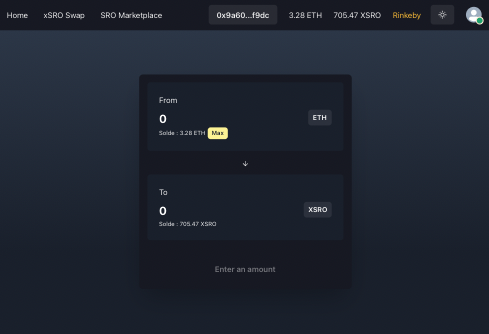

  
  

    <h1 align="center"><b>xSRO Swap</b></h1>
    

    <a href="#swap-about">À propos</a> 
      |
    <a href="#swap-design">Architecture</a>
      |
    <a href="#swap-feature">Caractéristiques</a>
      |
    <a href="#contract-faucets">ETH Faucets</a>
  

  <ul align="center">
    
    
    
    
  </ul>

----

  <h2><b>À propos</b></h2>
  <h4 id="swap-about" > <b>SarahRo</b> est une place de marché en ligne qui relie les artistes et les collectionneurs grâce à la technologie Blockchain pour vendre, investir et posséder facilement des œuvres d’art et des objets de collection en toute transparence. </h4>
  

  Pour plus d'informations : 
    <ul>
    <li>Site - <a href="https://www.sarahro.io">sarahro.io</a></li>
    <li>Swap xSRO - <a href="https://www.swap.sarahro.io">swap.sarahro.io</a></li>
    <li>Marketplace SRO - <a href="https://www.apps.sarahro.io">apps.sarahro.io</a></li>
    <li>Documentations SRO - <a href="https://www.docs.sarahro.io">docs.sarahro.io</a></li>
    <li><a href="https://www.docs.sarahro.io">Repertoires GitHub</a></li>
    <ul>
      <li>Front - <a href="https://github.com/SRO-SarahRo/xsro-front">xsro-front</a></li>
      <li>Swap - <a href="https://github.com/SRO-SarahRo/xsro-swap">xsro-swap</a></li>
      <li>Contrats - <a href="https://github.com/SRO-SarahRo/xsro-contracts">xsro-contracts</a> </li>
      <li>Base de donnée - <a href="https://github.com/SRO-SarahRo/bdd-sro">bdd-sro</a> </li>
      <li>Documentations - <a href="https://github.com/SRO-SarahRo/doc.xsro">doc.xsro</a> </li>
    </ul>
  </ul>
  

----

   
    <h2 id="swap-overview"><b>Aperçu</b></h2>
   

**NOTE:** 
- Le xSRO Swap a été déployé sur dans un sous-domaine du site sarahro.io qui celui ci est hébergé chez OVH à l'adresse suivante : https://swap.sarahro.io
- Le xSRO Swap a été déployé sur le testnet `Rinkeby`.
- Contrat ERC20 xSRO : `0xf94Bc0b0411284de46EEEE6C653A18CFd51Ef9C8`
- Contrat xSRO Swap : `0x87962cf7726020B6c902bB2e905Af880a248ab05`
- GitHub Swap xSRO : [ici](https://github.com/SRO-SarahRo/xsro-swap)

   
    <h2 id="swap-design"><b>Architecture</b></h2>
   

   
    <h2 id="swap-feature"><b>Caractéristiques</b></h2>
   

**NOTE : Le projet a été mis en place en utilisant**
- React : https://fr.reactjs.org/docs/create-a-new-react-app.html
- React-router-dom : https://github.com/ReactTraining/react-router/tree/master/packages/react-router-dom
- Ethers : https://github.com/ethers-io/ethers.js
- Framer-motion : https://github.com/framer/motion
- Web3-hooks (by [AbsoluteVirtueXI](https://github.com/AbsoluteVirtueXI/web3-hooks))

# 
## Comment ajouter votre jeton xSarahro personnalisé (xSRO) à MetaMask

1. Ouvrez MetaMask et cliquez sur l'icône du menu `burger` :
1. Cliquez sur le bouton `ADD TOKEN` :
1. Sélectionnez l'onglet `Custom Token` :
1. Collez l'adresse du contrat copiée lors de la première étape dans l'`Adresse du Token` (Vérification : Adresse, Symbole du Token et Décimale).
1. Cliquez sur le bouton `NEXT` :
1. Cliquez sur le bouton `ADD TOKENS` :
1. Vous avez terminé.

Vous pouvez suivre notre guide plus en détail sur notre [site](https://docs.sarahro.io/getting-started/metamask/integration/)

Cette section contient la liste des adresses des contrats déployés sur le réseau de test Ethereum [Rinkeby](https://rinkeby.etherscan.io/)

Contract Name   | Address                     | Explorers
:-------- |:----------------------------- |:-------------------------
`xSRO`   | 0xf94Bc0b0411284de46EEEE6C653A18CFd51Ef9C8 | [etherscan](https://rinkeby.etherscan.io/address/0xf94Bc0b0411284de46EEEE6C653A18CFd51Ef9C8) |
`Swap`   | 0x87962cf7726020B6c902bB2e905Af880a248ab05 | [etherscan](https://rinkeby.etherscan.io/address/0x87962cf7726020B6c902bB2e905Af880a248ab05) |

   
    <h2 id="swap-faucets"><b>ETH Faucets</b></h2>
   

# 
## **Testnet Ether Faucets**

Testnet   | Explorers                     | Testnet ETH Faucets
:-------- |:----------------------------- |:-------------------------
`Rinkeby`   | [etherscan](https://rinkeby.etherscan.io/) | [faucet](https://faucet.rinkeby.io/) |

 
